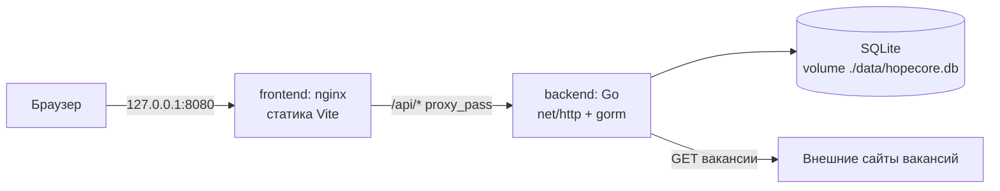
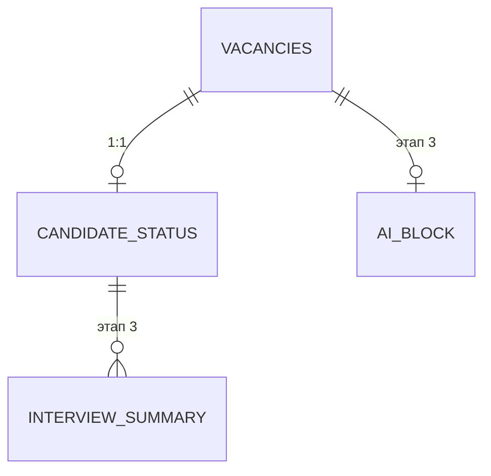
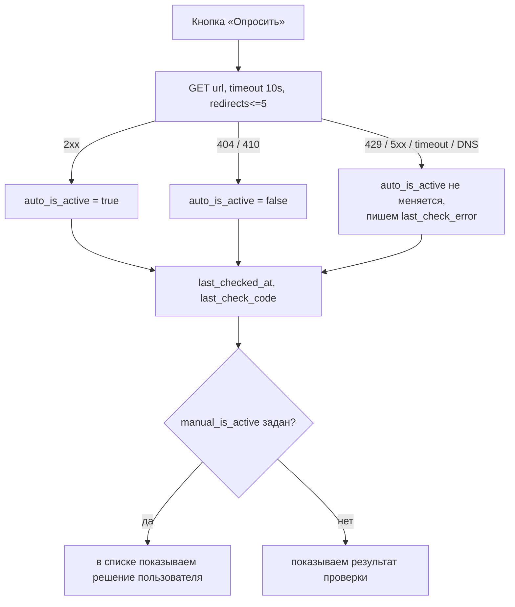

# Дизайн-документ: Этап 1 (MVP) — Персональный трекер вакансий

Исходное ТЗ: [`tz.md`](./tz.md), раздел «8. MVP и этапы», Этап 1.
Статус: на ревью. Код по документу ещё не написан.

---

## 1. Задача этапа

Собрать работающий локальный инструмент, покрывающий Этап 1 из ТЗ:

1. Ручное добавление вакансии по ссылке (Режим 1) — без обращения в сеть за содержимым страницы.
2. Таблица вакансий с сортировкой и скрытием неактивных.
3. Карточка вакансии с ручным заполнением статуса кандидата.
4. Кнопка ручного запуска обновления статуса активности — без LLM и без крона.

Вне области этапа: LLM/MCP-обзвон (Этап 2), нейроблок и приём резюме собеседований (Этап 3), авторизация, многопользовательский режим, фоновые задачи.

Окружение запуска — Docker. Целевой сценарий: `docker compose up --build` на машине кандидата.

---

## 2. Утверждённые решения

Решения приняты пользователем в ходе уточнения и являются входными данными для реализации, а не предложением.

| Область | Решение |
|---|---|
| Docker | `docker-compose`, два сервиса: `backend` (Go) и `frontend` (nginx + собранный Vite-бандл), файл SQLite в volume |
| Проверка активности | HTTP-код — только *подсказка*; финальное решение за пользователем, ручной override не перезатирается авто-проверкой |
| Схема БД | все 4 таблицы из ТЗ создаются сразу через `AutoMigrate`; UI и API в MVP работают только с `vacancies` и `candidate_status` |
| Backend | Go, `gorm v1.25.x` + `github.com/glebarez/sqlite v1.11.0` (чистый Go, без CGO) |
| Frontend | React (Vite) + Tailwind + shadcn/ui + TanStack Table + TanStack Query |
| Тесты | только backend: unit на чекер и логику активности + интеграционные на API поверх in-memory SQLite; фронт проверяется вручную |
| Авторизация | отсутствует (по п. 7 ТЗ), порт пробрасывается только на `127.0.0.1` |

---

## 3. Контекст и ограничения

- Репозиторий на момент старта пустой: `README.md` из одной строки и `docs/main/tz.md`. Ограничений от существующего кода нет, всё создаётся с нуля.
- Версии проверены через `proxy.golang.org`: `glebarez/sqlite v1.11.0` (март 2024) в своём `go.mod` требует `gorm.io/gorm v1.25.7`, тогда как актуальный gorm — `v1.31.2`. Поэтому gorm пинится на `v1.25.x`. Фолбэк при несовместимости — `gorm.io/driver/sqlite`, но он требует CGO: в Dockerfile понадобятся `gcc`/`musl-dev` и `CGO_ENABLED=1`.
- SQLite не поддерживает массивы, поэтому `tech_tags` из п. 4.1 ТЗ хранится как JSON-строка. Для этого вводится кастомный тип `Tags []string` с реализацией `sql.Scanner` и `driver.Valuer`.
- Календарные даты (`opened_date`, `sent_at`) хранятся как TEXT в формате `YYYY-MM-DD` через собственный тип `model.Date`. С обычным `time.Time` в API уезжали бы значения вида `2026-08-01T00:00:00Z`, а сравнение дат зависело бы от таймзоны контейнера. В JSON тип выглядит так же: `"2026-08-01"` или `null`.
- Нагрузка — один пользователь и десятки-сотни записей. Пагинация, кэширование и оптимизация запросов сознательно не делаются: таблица целиком влезает в один ответ.
- Секреты на этом этапе не нужны (LLM-провайдеры появляются на Этапе 2), но конфигурация сразу читается из переменных окружения, чтобы позже не переделывать.

---

## 4. Архитектура

### 4.1 Компоненты



nginx отдаёт статику и проксирует `/api/*` на `backend:8080`. Следствия: нет CORS-обвязки, наружу торчит один порт, фронт не знает адреса backend и обращается по относительному пути `/api`.

Зависимости пакетов направлены в одну сторону: `activity` не знает про БД (там только правило вычисления активности и HTTP-проверка), `store` не знает про сеть, а связывает их `service`. Поэтому оркестрация массовой проверки живёт в отдельном пакете, а не внутри `activity` — иначе получился бы цикл импортов с `store`.

Backend не публикует свой порт на хост — он доступен только внутри сети compose. Порт фронта биндится на `127.0.0.1:8080`, а не на `0.0.0.0`, потому что приложение не имеет авторизации и не должно быть доступно из локальной сети.

### 4.2 Структура репозитория

```
backend/
  cmd/server/main.go
  internal/config/      env: PORT, DB_PATH, CHECK_TIMEOUT, CHECK_CONCURRENCY, LOG_LEVEL
  internal/model/       Vacancy, CandidateStatus, InterviewSummary, AIBlock, Tags
  internal/store/       gorm open + AutoMigrate + запросы
  internal/activity/    Resolve (effective/conflict) + Checker (интерфейс + http-реализация)
  internal/service/     оркестрация: проверка одной и всех вакансий, worker pool
  internal/api/         router, handlers, dto, errors
  Dockerfile            multi-stage: golang:1.23-alpine -> alpine, CGO_ENABLED=0
frontend/
  src/api/              client.ts (fetch + ApiError), types.ts, vacancies.ts (хуки TanStack Query)
  src/lib/              utils.ts (cn), format.ts (даты, describeActivity), queryClient.ts
  src/components/ui/    button, badge, spinner (cva, стиль shadcn/ui)
  src/components/layout/ AppLayout, Sidebar
  src/pages/            VacanciesPage, NotFoundPage
  src/App.tsx           маршруты react-router
  scripts/smoke.mjs     ручной смоук: импорт всех модулей + рендер оболочки в строку
  Dockerfile            node:22-alpine build -> nginx:alpine
  nginx.conf            статика + proxy_pass /api -> backend:8080
docker-compose.yml      ports: 127.0.0.1:8080:80, volume ./data:/data
docs/main/design-stage1.md
```

### 4.3 Конфигурация и логирование

| Переменная | Назначение | Значение по умолчанию |
|---|---|---|
| `PORT` | порт HTTP-сервера backend | `8080` |
| `DB_PATH` | путь к файлу SQLite | `/data/hopecore.db` |
| `CHECK_TIMEOUT` | таймаут одного HTTP-запроса к сайту вакансии | `10s` |
| `CHECK_CONCURRENCY` | размер worker pool при массовой проверке | `4` |
| `LOG_LEVEL` | уровень логирования | `info` |

Логирование — `log/slog` в stdout, читается через `docker compose logs`. Алертинга нет, по п. 7 ТЗ достаточно записи ошибок обращения к внешним источникам.

---

## 5. Модель данных



Миграция создаёт все четыре таблицы сразу, чтобы позже не заниматься миграционной возней. API и UI в MVP используют только первые две.

### 5.1 `vacancies`

| Поле | Тип | Описание |
|---|---|---|
| id | integer PK | автоинкремент |
| url | text, not null | ссылка на вакансию |
| company | text | компания |
| grade | text | грейд из допустимого набора, пустое значение допустимо |
| tech_tags | text (JSON) | теги технологий, сериализованный `[]string` |
| opened_date | text (`YYYY-MM-DD`) | дата открытия вакансии |
| auto_is_active | bool, nullable | результат последней авто-проверки; `null` = неизвестно |
| manual_is_active | bool, nullable | ручное решение пользователя; `null` = override не задан |
| last_checked_at | timestamp, nullable | когда пользователь последний раз запускал проверку |
| last_check_code | integer, nullable | HTTP-код последнего ответа |
| last_check_error | text | текст ошибки последней проверки; пустая строка вместо NULL — отдельный смысл у NULL здесь не нужен |
| created_at | timestamp | когда добавлена |
| updated_at | timestamp | когда изменена (ведёт gorm) |

### 5.2 `candidate_status`

Связь 1:1 с вакансией, поля строго по п. 4.2 ТЗ: `vacancy_id` (FK, unique), `cover_letter`, `sent_at`, `interview_stage`, `hr_contact`, `interview_record_url`, `offer_received`, `offered_salary`, `real_salary`, `market_salary_data`.

Этап собеседования — свободный текст: в ТЗ набор этапов не зафиксирован, а у каждой компании он свой. Зарплаты проверяются на неотрицательность и вменяемость порядка (до 10⁹) — это ловит лишние нули при вводе, а не защищает от злоумышленника.

`PUT /candidate-status` заменяет представление целиком: отсутствующее в теле поле означает пустое значение, а не «не трогать». Это отличается от `PATCH` по вакансии и соответствует тому, как ведёт себя форма в UI — она присылает всё своё состояние. Сохранение статуса обновляет `updated_at` вакансии: для пользователя это правка карточки, и вакансия должна подняться в списке.

### 5.3 `interview_summary` и `ai_block`

Создаются миграцией по п. 4.3 и 4.4 ТЗ. В MVP не читаются и не пишутся: соответствующие секции карточки — плейсхолдеры с пометкой «Этап 3».

Допустимые грейды зафиксированы в модели: `intern`, `junior`, `middle`, `senior`, `lead`. Пустая строка тоже валидна — вакансию можно добавить по ссылке до того, как кандидат разобрался с уровнем. Валидация в API и подсказки в UI берут значения из этого одного места.

### 5.4 Настройки соединения

При открытии БД включаются `foreign_keys=on` (иначе SQLite игнорирует FK и каскадное удаление), `journal_mode=WAL` и `busy_timeout=5000`.

Пул ограничен одним соединением (`MaxOpenConns(1)`): SQLite плохо переносит параллельную запись, а инструмент однопользовательский, поэтому блокировки проще исключить, чем обрабатывать.

Важно при отладке: `foreign_keys` — настройка соединения, а не файла БД. Хостовая утилита `sqlite3` покажет `0`, хотя у приложения ограничения включены.

---

## 6. Семантика активности вакансии

Ключевое решение этапа. Одна колонка `is_active` не позволяет одновременно хранить результат авто-проверки и решение пользователя, поэтому состояние расщеплено на два nullable-поля, а отображаемое значение вычисляется:

```
effective_active = manual_is_active ?? auto_is_active ?? true
```

Новая вакансия считается активной, пока не доказано обратное. Клиенту отдаются:

- `is_active` — вычисленное эффективное значение;
- `activity_conflict` — `true`, когда ручной override расходится с результатом последней авто-проверки. В UI это иконка-подсказка «сайт говорит другое», а не автоматическое исправление.

Функция `activity.Resolve(auto, manual *bool) (effective bool, conflict bool)` живёт отдельно от HTTP-слоя и покрывается табличным тестом на все комбинации nullable-значений.

### 6.1 Классификация ответа при проверке



| Ответ | Трактовка |
|---|---|
| 2xx | вакансия активна |
| 404, 410 | вакансия снята |
| 3xx после лимита редиректов, 401, 403, 429, 5xx | результат неизвестен, предыдущее значение сохраняется, пишется `last_check_error` |
| таймаут, ошибка DNS, отказ соединения | результат неизвестен, `last_check_code` остаётся пустым |

Запрос уходит с осмысленным `User-Agent`, редиректы разрешены с лимитом 5. Эвристики по тексту страницы («вакансия закрыта», «архив») сознательно отложены: они требуют поддержки правил под каждый сайт, а риск ложно-активных записей закрывается ручным override.

### 6.2 Массовая проверка

Worker pool из `CHECK_CONCURRENCY` горутин. Обходятся все вакансии, кроме помеченных вручную как неактивные — по ним поход в сеть бессмысленен, решение уже принято пользователем. Вакансии, снятые по авто-проверке, опрашиваются: вакансию могли вернуть.

Ответ — агрегат, который UI показывает в toast-е:

| Поле | Смысл |
|---|---|
| `checked` | сколько вакансий реально опросили |
| `skipped` | сколько пропустили как закрытые вручную |
| `became_inactive` | сколько перешло из активных в снятые |
| `unknown` | сайт ответил, но код неинформативен (401, 403, 429, 5xx) |
| `failed` | ответа не было вовсе: таймаут, DNS, отказ соединения |

Проверка одной вакансии по кнопке выполняется даже при заданном override: пользователь нажал осознанно и вправе увидеть, что говорит сайт. Override при этом не меняется, расхождение отражается в `activity_conflict`.

Важное следствие для сортировки: проверка активности **не** обновляет `updated_at`, иначе массовый прогон перетасовал бы таблицу, отсортированную по дате изменения, хотя пользователь ничего не менял. Ручная смена override `updated_at` обновляет — это осознанное действие, и вакансия должна подняться в списке.

Таймауты согласованы по цепочке: один запрос — `CHECK_TIMEOUT` (10 с), весь массовый прогон — 4 минуты, `WriteTimeout` сервера — 5 минут, `proxy_read_timeout` в nginx — 300 с. Если прогон обрывается по таймауту или уходом клиента, уже сохранённые результаты остаются в БД, а клиент получает сводку по успевшим проверкам.

---

## 7. Контракт API

Базовый префикс `/api`. Формат — JSON.

| Метод | Путь | Назначение |
|---|---|---|
| GET | `/api/health` | health-check для compose |
| GET | `/api/vacancies?include_inactive=&sort=&order=` | список; по умолчанию `updated_at desc`, неактивные скрыты |
| POST | `/api/vacancies` | создать, обязателен `url` |
| GET | `/api/vacancies/{id}` | карточка вместе с вложенным `candidate_status` |
| PATCH | `/api/vacancies/{id}` | частичное обновление полей |
| DELETE | `/api/vacancies/{id}` | удалить вакансию, статус удаляется каскадом |
| PUT | `/api/vacancies/{id}/activity` | `{"manual_is_active": true \| false \| null}` — задать или снять override |
| POST | `/api/vacancies/{id}/check` | проверить одну вакансию |
| POST | `/api/vacancies/check` | проверить все |
| GET | `/api/vacancies/{id}/candidate-status` | статус кандидата отдельным запросом; 404, если не заполнен |
| PUT | `/api/vacancies/{id}/candidate-status` | upsert статуса кандидата (1:1) |

Единый формат ошибок:

```json
{ "error": { "code": "validation_failed", "message": "...", "fields": { "url": "..." } } }
```

Коды: `validation_failed`, `invalid_json`, `not_found`, `method_not_allowed`, `internal_error`. Служебные 404 и 405 от роутера тоже приводятся к этому формату — ответы хендлеров при этом не подменяются, признаком «ответ уже под контролем» служит выставленный `Content-Type: application/json`.

### 7.1 Соглашения контракта

- Валидация входа: `url` обязателен и должен парситься как абсолютный URL со схемой http/https; `grade` — из допустимого набора; текстовые поля ограничены 2000 символами, теги — 50 штук по 100 символов.
- Неизвестные поля в теле запроса отвергаются (`DisallowUnknownFields`): опечатка в имени поля должна быть заметна сразу, а не молча игнорироваться.
- PATCH различает три состояния поля: отсутствует — не трогать, `null` — очистить, значение — записать. Реализовано типом `Optional[T]`. Исключение — `url`: очистить его нельзя, вакансия без ссылки бессмысленна.
- Список возвращается объектом `{"items": [...]}`, а не массивом: так позже можно добавить метаданные, не ломая клиента.
- `sort` принимает только поля из белого списка (`updated_at`, `created_at`, `company`, `opened_date`, `grade`) — имя колонки подставляется в SQL и параметром не передаётся. Порядок дополняется вторичной сортировкой по `id`, чтобы выдача была стабильной при равных значениях.
- Некорректный `{id}` в пути (не число, ноль, отрицательный) даёт 404, а не 400: для клиента это просто несуществующий адрес.
- Фильтр активности в SQL — `COALESCE(manual_is_active, auto_is_active, 1) = 1`, то есть то же правило, что в `activity.Resolve`. Дублирование осознанное: фильтровать в БД дешевле, чем вычитывать всё и отбрасывать в Go. От расхождения двух реализаций страхует тест `TestActiveFilterSQLMatchesResolve`, прогоняющий все девять комбинаций nullable-значений.
- Ответ по вакансии содержит и вычисленное `is_active`, и исходные `auto_is_active` / `manual_is_active`: UI показывает, откуда взялось значение, и предлагает сбросить override.

---

## 8. Интерфейс

Требования по п. 6 ТЗ: тёмная админ-панель, сворачиваемое левое меню, таблица вакансий с сортировкой по дате изменения и скрытием неактивных, карточка по клику на строку.

- Тема — Tailwind v4 (CSS-first, без `tailwind.config.js`) с палитрой zinc, разложенной по семантическим токенам в блоке `@theme`: компоненты ссылаются на смысл (`surface`, `border`, `muted`), а не на оттенок. Светлой темы нет, переключателя тоже — по п. 6 ТЗ интерфейс тёмный.
- Компоненты пишутся вручную в стиле shadcn/ui (`cva` + `cn` на `clsx`/`tailwind-merge`), без запуска CLI: нужен небольшой набор, а генератор притащил бы лишнее.
- Левая панель сворачивается, состояние хранится в `localStorage`. Табы: «Вакансии» активен, «Поиск LLM» и «Нейроблок» — disabled-заглушки с пометкой этапа.
- Ошибки API разбираются в класс `ApiError` с полями `code` и `fields`, чтобы форма раскладывала сообщения по инпутам, а не показывала одну строку на весь диалог. Имена ключей в `fields` совпадают с именами полей формы, поэтому маппинг прямой.
- Модальные окна — на нативном `<dialog>` вместо Radix: платформа сама даёт роль `dialog` с `aria-modal`, захват фокуса, закрытие по Escape и затемнение через `::backdrop`. Для трёх диалогов Этапа 1 этого достаточно, и зависимость не нужна.
- Форма вакансии одна на создание и правку: без вакансии в пропсах работает как «Добавить», с вакансией — как «Изменить». Клиентская валидация ссылки повторяет серверную, чтобы не отправлять заведомо битый запрос; остальное проверяет сервер, и его ошибки раскладываются по полям.
- Дата вводится нативным `<input type="date">`: он отдаёт ровно `YYYY-MM-DD`, то есть формат API, без библиотеки календаря.
- Таблица на TanStack Table v9 (API `tableFeatures` + `useTable`; подключается только сортировка, остальные возможности в бандл не попадают). Колонки: компания, грейд, теги, активность, дата отклика, этап собеседования, дата изменения. По умолчанию `updated_at desc`. Тумблер «Показать неактивные». Предусмотрены пустое состояние, состояние загрузки и состояние ошибки.
- **Сортировка выполняется на клиенте**, хотя сервер её тоже умеет. Список приходит целиком (десятки-сотни записей, пагинации нет), зато сортировать можно по любому столбцу — включая этап собеседования и дату отклика, которых нет в белом списке сортировки на сервере. Серверные `sort` и `order` остаются частью контракта API и задают порядок по умолчанию.
- Флаг «показать неактивные» хранится в URL (`?inactive=1`), а не в состоянии компонента: вид виден в адресной строке, восстанавливается по ссылке и кнопкой «назад» из карточки.
- Карточка — роут `/vacancies/:id`: данные вакансии, форма статуса кандидата с сохранением по кнопке, плейсхолдеры «Резюме собеседования» и «Нейроблок». Заглушки видны, а не скрыты: место для данных предусмотрено, и понятно, почему оно пустое.
- Активность в карточке — отдельный блок: пояснение о происхождении значения, дата последней проверки с кодом ответа, кнопка «Опросить сейчас» и переключатель из трёх состояний — «По проверке» (снять override), «Активна», «Снята». Переключатель на радиокнопках с `role="radiogroup"`, а не на трёх кнопках: это выбор одного значения из набора.
- Уведомления — свой минимальный `ToastProvider` без зависимостей, с `role="status"` и `aria-live="polite"`. Ошибки живут дольше информационных сообщений: их читают. В сводке массовой проверки нулевые счётчики не показываются, чтобы текст оставался коротким.
- Форма статуса хранит зарплаты строками, а не числами: иначе не отличить «не заполнено» от «ноль». Кнопка сохранения заблокирована, пока нет изменений; рядом живёт `aria-live`-область с сообщением «Есть несохранённые изменения» или «Сохранено».
- Внешнее обновление данных (перезапрос карточки) не затирает несохранённый ввод: форма синхронизируется с сервером только если пользователь ничего не менял с последнего сохранения. После сохранения состояние берётся из ответа сервера, а не из отправленного payload — сервер обрезает пробелы, и форма должна показывать то, что действительно записано.
- Доступность: у таблицы есть `caption`, заголовки с `scope="col"` и `aria-sort`, сортировка переключается кнопкой внутри `th`. Строка открывается кликом мышью, но клавиатурный путь идёт через ссылку в колонке «Компания» — так работает Cmd-клик и виден адрес перехода, а строка не дублируется в tab-порядке. Активность обозначена не только цветом: рядом с бейджем стоят иконки «задано вручную» и «сайт сообщает обратное», обе с текстом для скринридера.
- Серверное состояние — TanStack Query, с инвалидацией кэша после мутаций.

---

## 9. Отступления от буквы ТЗ

1. **`is_active` расщеплён** на `auto_is_active` и `manual_is_active`, а отдаваемое значение вычисляется. Без этого утверждённое поведение «ручной override не перезатирается авто-проверкой» нереализуемо.
2. **`last_checked_at` означает «когда пользователь вручную запускал проверку»**, а не «когда крон проверял», как сказано в п. 4.1 ТЗ. Крона нет по прямому требованию п. 3 ТЗ.

Оба отступления не меняют смысл требований, а приводят схему в соответствие с уже утверждённым поведением.

---

## 10. Риски

| Риск | Реакция |
|---|---|
| `glebarez/sqlite v1.11.0` собран под gorm `v1.25.7`, актуальный gorm — `v1.31.2` | пин gorm на `v1.25.x`; фолбэк — CGO-драйвер `gorm.io/driver/sqlite` с правкой Dockerfile |
| Сайты отдают 200 на снятую вакансию → ложно-активные записи | ручной override; текстовые эвристики отложены осознанно |
| Отсутствие авторизации | обязательный bind порта на `127.0.0.1`, backend не публикуется на хост |
| Сайты вакансий блокируют автоматические запросы (429/403) | такой ответ трактуется как «неизвестно» и не меняет состояние, ошибка видна пользователю |

---

## 11. План работ

Задачи идут инкрементально: каждая заканчивается проверяемым состоянием, а не «полуготовым слоем».

**Task 1. Дизайн-документ**
Этот файл. Фиксирует стек с пинами версий, схему БД с семантикой `auto/manual_is_active`, контракт API, правила классификации HTTP-ответов, структуру репозитория, схему Docker, отступления от ТЗ и риски.
*Demo:* документ читается как самодостаточное ТЗ на реализацию; решения можно обсудить до написания кода.

**Task 2. Скелет монорепо + docker-compose + health**
`go mod init`, минимальный `net/http` сервер с `GET /api/health`, проект Vite + React + TS с плейсхолдером, оба Dockerfile, `nginx.conf` с прокси на backend, `docker-compose.yml` с volume и healthcheck. Тест: `TestHealth` через `httptest`.
*Demo:* `docker compose up --build` → `http://127.0.0.1:8080` открывает страницу, `/api/health` отвечает `{"status":"ok"}`.

**Task 3. Модель данных и миграции**
Четыре gorm-модели, кастомный тип `Tags` (JSON ↔ `[]string`), `store.Open()` + `AutoMigrate`, включение `foreign_keys=on` и `journal_mode=WAL`. Тесты: миграция на in-memory БД создаёт все таблицы; round-trip `Tags` сохраняет порядок и корректно обрабатывает пустой список.
*Demo:* при старте контейнера в `./data/hopecore.db` появляется файл со всеми четырьмя таблицами (проверяется `sqlite3 .schema`).

**Task 4. CRUD вакансий**
Хендлеры list/create/get/patch/delete, DTO с валидацией, фильтр `include_inactive`, сортировка `updated_at desc` по умолчанию, единый формат ошибок. Тесты: интеграционные на роутер поверх in-memory SQLite — happy path каждого метода, 404 на несуществующий id, 400 на битый url, проверка порядка сортировки.
*Demo:* через `curl` вакансия создаётся, читается, правится и удаляется; после правки она первая в списке.

**Task 5. Логика активности и HTTP-чекер**
`activity.Resolve` с табличным тестом сделан досрочно в Task 4: без него не собрать фильтр `include_inactive`. Остаётся интерфейс `Checker` и его http-реализация с таймаутом, лимитом редиректов и User-Agent, классификация ответов, endpoints `PUT /activity`, `POST /{id}/check`, `POST /check` с worker pool. Тесты: чекер против `httptest.Server` (200, 404, 410, 500, таймаут, цепочка редиректов), интеграционный тест «ручное `false` не перезатирается ответом 200, выставляется `activity_conflict`».
*Demo:* `POST /api/vacancies/check` проходит по реальным ссылкам, помечает битые неактивными и возвращает сводку; вручную закрытая вакансия остаётся закрытой.

**Task 6. Статус кандидата**
`PUT /api/vacancies/{id}/candidate-status` с upsert-семантикой, вложение статуса в `GET /api/vacancies/{id}`. Тесты: создание, повторный вызов обновляет запись без дублей, каскадное удаление вместе с вакансией.
*Demo:* к вакансии через API прикрепляются сопроводительное, дата отклика и этап собеседования; карточка отдаёт их одним запросом.

**Task 7. Оболочка админки**
Tailwind + shadcn/ui в тёмной теме, сворачиваемая левая панель с табами и заглушками, TanStack Query provider, типизированный API-клиент, на главной — список вакансий из настоящего API.
*Demo:* тёмная админка в браузере, сайдбар сворачивается, список подтягивается через nginx-прокси.

**Task 8. Таблица вакансий**
TanStack Table с описанными колонками, сортировкой, дефолтом `updated_at desc`, тумблером «Показать неактивные», пустым состоянием и состояниями загрузки/ошибки, клавиатурной доступностью строк.
*Demo:* таблица сортируется, неактивные скрываются и показываются по тумблеру, строки открываются с клавиатуры.

**Task 9. Форма добавления и редактирования вакансии**
Диалог с полями по п. 4.1 ТЗ, теги через chips-input, клиентская валидация url, маппинг серверных ошибок на поля, инвалидация кэша после сохранения.
*Demo:* вакансия добавляется по ссылке из UI и сразу появляется в таблице; правки сохраняются.

**Task 10. Карточка вакансии**
Роут карточки, секции данных вакансии и формы статуса кандидата, плейсхолдеры «Резюме собеседования» и «Нейроблок» с пометкой «Этап 3».
*Demo:* клик по строке открывает карточку, статус заполняется и сохраняется, после перезагрузки данные на месте.

**Task 11. Ручная проверка и override в UI**
Кнопка «Опросить сейчас» в карточке и «Опросить все» над таблицей с индикатором прогресса, переключатель ручного статуса активности с опцией «вернуть авто», toast-ы с результатом и сводкой, отображение `last_checked_at` и кода ответа.
*Demo:* сквозной сценарий MVP из UI — добавил вакансию, заполнил статус, опросил все ссылки, увидел сводку, переопределил активность вручную и убедился, что проверка её не сбросила.

**Task 12. Прод-сборка и документация запуска**
Пины версий в `go.mod` и `package.json`, `.dockerignore`, `.env.example`, `README.md` с инструкцией запуска и таблицей переменных окружения, финальный прогон `go test ./...` и `docker compose up --build` на чистом volume.
*Demo:* на чистой машине `git clone && docker compose up --build` даёт рабочий трекер, тесты зелёные.
