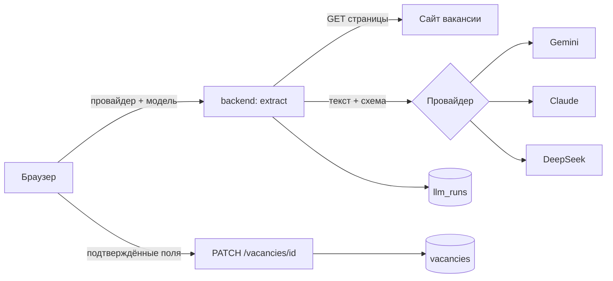
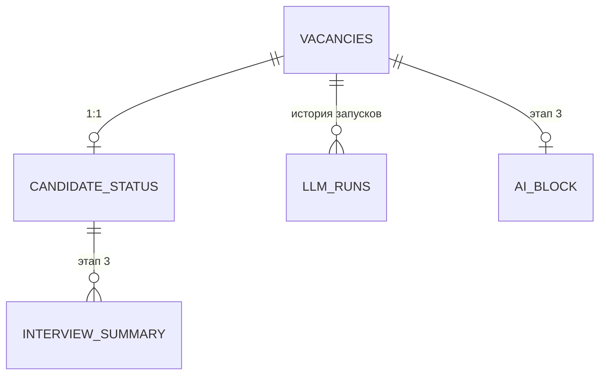
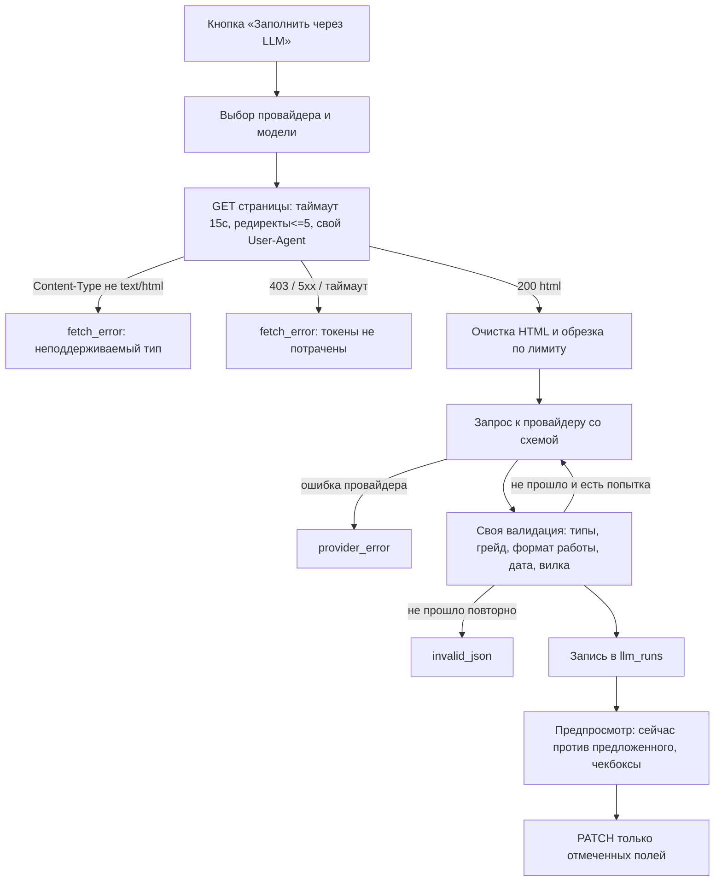

# Дизайн-документ: Этап 2 (LLM-автозаполнение вакансии)

Исходное ТЗ: [`tz.md`](./tz.md) — п. 3 (Режим 2), п. 5.1, 5.3, п. 7, п. 8.
Предыдущий этап: [`design-stage1.md`](./design-stage1.md).
Статус: на ревью. Код по документу ещё не написан.

---

## 1. Задача этапа

Кандидат вставляет ссылку на вакансию и по кнопке получает поля карточки, извлечённые языковой моделью со страницы. Провайдер и модель выбираются перед каждым запуском, результат применяется только после подтверждения.

Входит в этап:

1. Три провайдера LLM — Gemini, Claude, DeepSeek — с выбором перед каждым запуском.
2. Скачивание страницы вакансии и извлечение полей структурированным запросом к модели.
3. Предпросмотр найденного рядом с текущими значениями и выборочное применение.
4. Журнал запусков: чем, когда, сколько токенов и на какую сумму.
5. Новые поля вакансии: должность, зарплатная вилка, формат работы — заполняются и вручную, и моделью.

Не входит:

- **Поиск вакансий по критериям через API источников** — отложен до Этапа 2.1, см. п. 10. Причина: `api.hh.ru` больше не отдаёт вакансии анонимно, нужен токен приложения, заявка на доступ подана.
- Проверка активности через LLM. Остаётся на HTTP-кодах, как в Этапе 1 (п. 6 дизайна Этапа 1). Случай «сайт отдаёт 200 на снятую вакансию» по-прежнему закрывается ручным override.
- Нейроблок и приём резюме собеседований — Этап 3.

Крона по-прежнему нет: ни один запрос к внешним сайтам и моделям не уходит без нажатия кнопки (п. 3 и п. 7 ТЗ).

---

## 2. Утверждённые решения

Приняты в ходе уточнения, являются входными данными для реализации.

| Область | Решение |
|---|---|
| Область этапа | Только извлечение по вставленной ссылке; поиск по источникам → Этап 2.1 |
| Скачивание страниц | Обычный HTTP + очистка HTML, без headless-браузера |
| Структурированный вывод | Нативный режим каждого провайдера |
| Применение результата | Предпросмотр с выбором полей; автоприменения нет |
| Проверка активности | Только HTTP-коды, LLM не участвует |
| Журнал | Таблица `llm_runs` + отдельный экран в интерфейсе |
| Выбор модели | Ключи и списки моделей в env; в интерфейсе выбирается и провайдер, и модель |
| Новые поля вакансии | `title`, зарплатная вилка, формат работы — с ручным вводом наравне с извлечением |
| Тесты | Как в Этапе 1: только backend, сеть в тестах не используется |

---

## 3. Контекст и ограничения

### 3.1 Что проверено эмпирически

Запросы к `api.hh.ru` от 10 августа 2026:

| Эндпоинт | Ответ |
|---|---|
| `/vacancies?text=go&area=1` | `403` `{"errors":[{"type":"forbidden"}]}`, заголовок `server: ddos-guard` |
| `/vacancies/1` | `403`, то же |
| `/dictionaries` | `200`, включая справочники `experience`, `schedule`, `work_format` |
| `/areas/1` | `200`, «Москва», `parent_id: 113` |
| `/professional_roles` | `200` |
| любой запрос без `User-Agent` | `400` `bad_user_agent` |

Вывод: чтение вакансий требует токена приложения, справочники открыты. HTML-выдача `hh.ru` закрыта тем же ddos-guard, то есть парсинг страниц поиска — не обходной путь.

### 3.2 Структурированный вывод у провайдеров

| Провайдер | Нативный режим | Что гарантируется |
|---|---|---|
| Gemini | `responseSchema` ([документация](https://ai.google.dev/gemini-api/docs/structured-output)) | соответствие схеме |
| Claude | structured outputs: схема в запросе либо через определение tool ([документация](https://platform.claude.com/docs/en/build-with-claude/structured-outputs)) | соответствие схеме |
| DeepSeek | `response_format: {"type":"json_object"}` ([документация](https://api-docs.deepseek.com/guides/json_mode)) | только валидный JSON; схема не проверяется, её нужно описать в промпте |

Следствия для реализации: своя валидация обязательна для всех трёх провайдеров, а не только для DeepSeek — нативный режим гарантирует форму, но не смысл (грейд может прийти строкой не из нашего набора). Для DeepSeek к валидации добавляется одна повторная попытка с текстом ошибки, потому что схема на его стороне не проверяется.

### 3.3 Точки крепления в существующем коде

- `PATCH /api/vacancies/{id}` уже умеет частичное обновление с тремя состояниями поля (`Optional[T]`), поэтому применение выбранных полей не требует нового пути записи.
- `internal/service` — готовое место для оркестрации, зависимости направлены в одну сторону: `activity` и новый `llm` не знают про БД, `store` не знает про сеть.
- `internal/activity` в этом этапе не меняется.
- Единый формат ошибок и `ApiError` на фронте переиспользуются как есть.

### 3.4 Ограничения подхода со скачиванием страниц

Часть карьерных сайтов (`tbank.ru`, `job.alfabank.ru`) рендерит вакансию на JavaScript. Обычный `GET` вернёт каркас без текста, и модель начнёт угадывать. Headless-браузер сознательно отвергнут: +300-500 МБ к образу и заметное усложнение локального инструмента. Вместо блокировки запуска мы считаем объём полученного текста, храним его в журнале и предупреждаем в предпросмотре, когда текста мало.

---

## 4. Архитектура

### 4.1 Компоненты



Главное свойство: `extract` не пишет в вакансию. Он возвращает найденное вместе с текущими значениями, а запись идёт существующим `PATCH` после подтверждения пользователем. Так автоприменение невозможно даже по ошибке, а путь записи остаётся один.

### 4.2 Структура кода

```
backend/internal/
  llm/                  Provider (интерфейс), реестр, схема извлечения, валидация, расчёт стоимости
  llm/gemini/           адаптер: responseSchema
  llm/claude/           адаптер: structured outputs
  llm/deepseek/         адаптер: json_object + схема в промпте + повторная попытка
  fetcher/              скачивание страницы и очистка HTML
  service/extraction.go оркестрация: fetch → provider → validate → llm_run
  store/llm_runs.go     запись и чтение журнала
  api/extract.go        POST /vacancies/{id}/extract
  api/llm.go            GET /llm/providers, /llm/runs, /llm/runs/{id}

frontend/src/
  api/llm.ts            хуки: провайдеры, запуск извлечения, журнал
  components/vacancies/ExtractDialog.tsx    выбор провайдера и модели
  components/vacancies/ExtractPreview.tsx   предпросмотр с чекбоксами по полям
  pages/LlmRunsPage.tsx                     экран «Запуски LLM»
```

### 4.3 Конфигурация

| Переменная | Назначение | По умолчанию |
|---|---|---|
| `GEMINI_API_KEY` | ключ Gemini; без него провайдер скрыт | — |
| `ANTHROPIC_API_KEY` | ключ Claude | — |
| `DEEPSEEK_API_KEY` | ключ DeepSeek | — |
| `LLM_GEMINI_MODELS` | список моделей через запятую | одна разумная модель |
| `LLM_CLAUDE_MODELS` | то же | одна разумная модель |
| `LLM_DEEPSEEK_MODELS` | то же | одна разумная модель |
| `LLM_<PROVIDER>_PRICE_INPUT` | цена за 1M входных токенов | — |
| `LLM_<PROVIDER>_PRICE_OUTPUT` | цена за 1M выходных токенов | — |
| `LLM_TIMEOUT` | таймаут запроса к модели | `60s` |
| `LLM_FETCH_TIMEOUT` | таймаут скачивания страницы | `15s` |
| `LLM_MAX_PAGE_CHARS` | сколько символов страницы отдавать модели | `40000` |

Ключи не попадают ни в логи, ни в ответы API: `GET /api/llm/providers` отдаёт только идентификаторы провайдеров и списки моделей. Прайс задаётся необязательно — без него в интерфейсе показываются только токены, без суммы.

Первый провайдер в конфигурации становится предвыбранным в диалоге, но запуск всё равно требует нажатия кнопки.

### 4.4 Таймауты

Цепочка согласована так же, как в Этапе 1: скачивание страницы — `LLM_FETCH_TIMEOUT` (15 с), запрос к модели — `LLM_TIMEOUT` (60 с), запас на весь запрос в `WriteTimeout` сервера (5 минут) и `proxy_read_timeout` в nginx (300 с) уже достаточен, менять их не нужно.

---

## 5. Модель данных



### 5.0 Смежное исправление в Этапе 1

По ходу Task 2 файл БД один раз оказался повреждён на связке «WAL + bind-mount Docker Desktop»: после остановки контейнера главный файл был заполнен нулями. Журнал переведён с `WAL` на откатный, добавлено понятное сообщение об открытии испорченного файла. Подробности и результаты проверки — в п. 5.4 [дизайна Этапа 1](./design-stage1.md).

### 5.1 Новые поля `vacancies`

Добавляются миграцией; это отступление от п. 4.1 ТЗ, согласованное отдельно (см. п. 11).

| Поле | Тип | Описание |
|---|---|---|
| `title` | text | должность: «Go-разработчик», «Backend Engineer» |
| `salary_from` | numeric, nullable | нижняя граница вилки |
| `salary_to` | numeric, nullable | верхняя граница вилки |
| `salary_currency` | text | код валюты, три буквы; по умолчанию `RUB`, когда вилка задана |
| `salary_gross` | bool, nullable | `true` — до вычета налогов, `false` — на руки, `null` — не указано |
| `work_format` | text | формат работы из набора, пустое значение допустимо |

Допустимые форматы работы: `onsite` (в офисе), `hybrid` (гибрид), `remote` (удалённо). Набор фиксируется в модели рядом с `Grades`, чтобы валидация в API и подсказки в UI брались из одного места.

Правила валидации: границы вилки неотрицательны и не больше 10⁹ (как у зарплат в статусе кандидата), `salary_from` не больше `salary_to`, если заданы обе; валюта — три латинские буквы в верхнем регистре; при непустой вилке пустая валюта заполняется значением `RUB`.

Важное разделение смыслов, чтобы поля не путались: `salary_from` и `salary_to` — это **вилка из объявления**, а `offered_salary` и `real_salary` в `candidate_status` — то, что предложили лично кандидату и что известно про реальные выплаты. Первое приходит со страницы, второе кандидат заполняет сам.

### 5.2 Таблица `llm_runs`

Журнал запусков: и трат по квоте, и происхождения данных в карточке.

| Поле | Тип | Описание |
|---|---|---|
| `id` | integer PK | |
| `created_at` | timestamp | |
| `purpose` | text | `extract_vacancy`; на Этапе 3 добавится `ai_block` |
| `vacancy_id` | FK, nullable | `ON DELETE SET NULL` — история трат переживает удаление вакансии |
| `provider` | text | `gemini`, `claude`, `deepseek` |
| `model` | text | конкретная модель, как её выбрал пользователь |
| `prompt_version` | text | версия промпта: без неё нельзя понять, чем получен старый результат |
| `source_url` | text | какую страницу скачивали |
| `source_chars` | integer | сколько символов текста ушло в модель после очистки |
| `status` | text | `ok`, `fetch_error`, `provider_error`, `invalid_json`, `timeout` |
| `input_tokens` | integer, nullable | из ответа провайдера |
| `output_tokens` | integer, nullable | из ответа провайдера |
| `cost_estimate` | numeric, nullable | оценка по прайсу из конфигурации; `null`, если прайс не задан |
| `attempts` | integer | сколько вызовов модели потребовалось (для DeepSeek может быть 2) |
| `duration_ms` | integer | |
| `error` | text | причина неудачи в понятном виде |
| `response_json` | text | сырой ответ модели — чтобы можно было посмотреть, что она сказала |

Запись создаётся на **всех** путях, включая неудачные. Ошибка скачивания тоже попадает в журнал, но с нулевыми токенами: видно, что попытка была и почему она ничего не стоила.

---

## 6. Извлечение полей

### 6.1 Поток



### 6.2 Очистка HTML

Удаляются `script`, `style`, `noscript`, `svg`, комментарии и теги навигации; остальные теги заменяются пробелом; последовательности пробелов и переводов строк сжимаются; текст обрезается до `LLM_MAX_PAGE_CHARS` символов. Обрезка идёт с конца: начало страницы обычно содержит заголовок и условия, а низ — подвал сайта.

Объём результата сохраняется в `source_chars`. Если он меньше 500 символов, в ответе `extract` появляется предупреждение «страница почти без текста, вероятно, она рендерится на JavaScript» — запуск при этом не блокируется, по принятому решению.

### 6.3 Схема извлечения

Одна внутренняя схема, которая переводится в формат каждого провайдера, — поле добавляется в одном месте.

| Поле | Тип | Правила |
|---|---|---|
| `title` | string | пустая строка, если не нашлось |
| `company` | string | пустая строка, если не нашлось |
| `grade` | enum | `intern`, `junior`, `middle`, `senior`, `lead` или пусто |
| `tech_tags` | array of string | до 50 элементов, порядок по значимости |
| `opened_date` | string, nullable | `YYYY-MM-DD` |
| `salary_from` | number, nullable | |
| `salary_to` | number, nullable | |
| `salary_currency` | string, nullable | три буквы |
| `salary_gross` | boolean, nullable | |
| `work_format` | enum | `onsite`, `hybrid`, `remote` или пусто |

Промпт задаёт три правила поведения: не выдумывать значения, которых нет на странице (возвращать пустое); грейд определять по требуемому опыту, если он не назван прямо; переводить формат работы в наш набор, а не копировать формулировку сайта.

Промпт хранится в коде с константой версии — она пишется в `llm_runs.prompt_version`, чтобы старые результаты можно было объяснить.

### 6.4 Валидация и повторная попытка

Своя валидация проверяет то, чего не даёт даже строгая схема провайдера: грейд и формат работы из наших наборов, дату как настоящую дату, вилку на порядок и на `from <= to`, длину строк. Поля, не прошедшие проверку, не отбрасывают весь ответ — они помечаются замечанием и не предлагаются к применению. Так одна выдуманная дата не обнуляет остальные пятнадцать корректных полей.

Повторная попытка делается один раз и только когда ответ вообще не разобрался в JSON или не соответствует схеме — то есть на практике для DeepSeek. Счётчик `attempts` фиксирует это в журнале.

---

## 7. Провайдеры

```go
type Provider interface {
    ID() string
    Models() []string
    Complete(ctx context.Context, req Request) (Response, error)
}
```

`Request` несёт system-промпт, текст страницы, схему и выбранную модель. `Response` — JSON-байты ответа и счётчики токенов. Адаптеры изолированы по пакетам и не знают ни про БД, ни про HTTP-слой приложения.

Реестр собирается на старте: провайдер попадает в список доступных, только если у него задан ключ. Если ключей нет ни у одного, приложение работает как в Этапе 1, а `GET /api/llm/providers` отдаёт пустой список — это не ошибка.

Оценка стоимости считается из токенов и прайса конфигурации, поэтому в интерфейсе везде слово «оценка»: цены провайдеров меняются, а конфигурация устаревает.

---

## 8. Контракт API

| Метод | Путь | Назначение |
|---|---|---|
| GET | `/api/llm/providers` | доступные провайдеры и их модели |
| POST | `/api/vacancies/{id}/extract` | `{provider, model}` → найденные поля, текущие значения, замечания; в вакансию не пишет |
| GET | `/api/llm/runs` | журнал запусков, свежие сверху |
| GET | `/api/llm/runs/{id}` | запуск целиком, включая сырой ответ модели |

Применение изменений — существующий `PATCH /api/vacancies/{id}`. Новых путей записи в вакансию не появляется.

Ответ `extract` устроен так, чтобы интерфейс мог построить предпросмотр без дополнительных запросов:

```json
{
  "run_id": 12,
  "status": "ok",
  "provider": "gemini",
  "model": "...",
  "source_chars": 8412,
  "fields": {
    "title":   { "extracted": "Go-разработчик", "current": "" },
    "grade":   { "extracted": "senior", "current": "middle" },
    "opened_date": { "extracted": null, "current": "2026-08-01", "note": "дата на странице не найдена" }
  },
  "warnings": ["..."],
  "usage": { "input_tokens": 5210, "output_tokens": 180, "cost_estimate": 0.0032 }
}
```

Коды ошибок дополняются двумя: `provider_unavailable` (провайдер не выбран или у него нет ключа) и `extraction_failed` (страница не скачалась или ответ не удалось привести к схеме). Оба приходят в общем формате `{"error": {...}}` из Этапа 1.

---

## 9. Интерфейс

- Сайдбар: появляется рабочий раздел «Запуски LLM». Текущая заглушка «Поиск LLM» переименовывается в «Поиск вакансий» с пометкой «Этап 2.1» — поиск отложен, и это должно быть видно.
- Форма вакансии получает новые поля: должность, вилка (от, до, валюта, признак «до вычета налогов») и формат работы. Они заполняются вручную наравне с остальными: Режим 1 из ТЗ остаётся полноценным и не зависит от наличия ключей.
- Таблица вакансий получает столбец с вилкой и показывает формат работы рядом с грейдом. Должность становится основным текстом первой колонки, компания — подписью под ней.
- Карточка вакансии: кнопка «Заполнить через LLM» рядом с «Изменить». Диалог выбора провайдера и модели, затем ожидание, затем предпросмотр: два столбца «сейчас» и «модель предлагает», чекбокс на каждом поле, отмечены только те, где значение отличается и прошло валидацию. Кнопка «Применить отмеченные».
- Если ключей нет ни у одного провайдера, кнопка выключена, в подсказке — куда положить ключ.
- Экран «Запуски LLM»: таблица (дата, провайдер и модель, вакансия, статус, токены, оценка стоимости, длительность), итоги за всё время сверху, клик по строке — детали с сырым ответом модели.
- Доступность: диалог предпросмотра — таблица с `caption` и заголовками `scope`, чекбоксы с подписями по имени поля; предупреждения выводятся в область с `role="status"`.

---

## 10. Отложено до Этапа 2.1: поиск через API источников

Раздел собирает уже выясненное, чтобы после получения токена не разбираться заново.

- Для `api.hh.ru` нужно зарегистрировать приложение на `dev.hh.ru` и передавать токен; ключ пойдёт в env рядом с ключами LLM. Заявка на доступ подана.
- Обязателен непустой `User-Agent`, иначе `400 bad_user_agent`.
- Справочники `/areas`, `/dictionaries`, `/professional_roles` доступны без токена и годятся, чтобы валидировать фильтр и переводить «мск» в `area=1`.
- Критерии поиска из п. 3 ТЗ (грейд, стек, вилка, регион, формат) мапятся на параметры `text`, `area`, `experience`, `salary`, `work_format` **напрямую**, поэтому языковая модель в поиске не нужна: она понадобится только если захочется вводить запрос свободной фразой.
- Официального MCP-сервера у hh.ru нет; существующие — неофициальные обёртки над тем же REST API. Поэтому формулировку п. 3 ТЗ про «MCP-сервер с официальным API» на практике закрывает прямой REST-клиент, а MCP при необходимости встанет позже за тем же внутренним интерфейсом источника.
- Импорт найденного должен дедуплицироваться по `url`: одна и та же вакансия не должна заводиться дважды.

---

## 11. Отступления от ТЗ

1. **Новые поля вакансии.** В п. 4.1 ТЗ нет должности, зарплатной вилки и формата работы. Все три добавлены по отдельному согласованию: извлечение со страницы всегда даёт эти данные, а хранить их было негде. Поля обычные, с ручным вводом, а не «только для LLM».
2. **Поиск по критериям перенесён в Этап 2.1.** Причина внешняя: анонимный доступ к вакансиям `hh.ru` закрыт, нужен токен приложения. Проверено запросами, факты в п. 3.1.
3. **LLM не участвует в проверке активности**, хотя п. 3 ТЗ допускает использование того же механизма. Решение принято сознательно: проверка активности массовая, а траты по квоте должны оставаться редкими и явными.
4. **MCP не используется.** Официального сервера у hh.ru нет, а неофициальный добавил бы второй рантайм в образ и лишний слой над тем же API. Внутренний интерфейс источника оставляет MCP возможным позже.

---

## 12. Риски

| Риск | Реакция |
|---|---|
| SPA-страницы отдают каркас без текста, модель начинает угадывать | считаем `source_chars`, предупреждаем в предпросмотре, храним сырой ответ; блокировки нет по принятому решению |
| Анти-бот на карьерных сайтах (`403`, капча) | статус `fetch_error`, токены не тратятся, причина видна в журнале |
| DeepSeek не гарантирует соответствие схеме | своя валидация для всех провайдеров + одна повторная попытка |
| Модель выдумывает значения, которых нет на странице | правило в промпте, валидация по наборам, и главное — предпросмотр: без подтверждения ничего не записывается |
| Дрейф API провайдеров | адаптеры изолированы, у каждого свои тесты на httptest-стабах; ломается один — остальные работают |
| Прайс в конфигурации устаревает | везде слово «оценка»; без прайса показываем только токены |
| Длинные страницы жгут токены | лимит символов, фактический объём виден в журнале |
| Ключи в логах | ключи не логируются и не возвращаются API; в журнал пишутся только провайдер и модель |

---

## 13. План работ

**Task 1. Дизайн-документ**
Этот файл.
*Demo:* документ читается как самодостаточное ТЗ на Этап 2, решения можно обсудить до кода.

**Task 2. Новые поля вакансии в backend**
Миграция (`title`, `salary_from`, `salary_to`, `salary_currency`, `salary_gross`, `work_format`), набор форматов работы в модели, DTO и валидация в `POST`/`PATCH`, отдача в ответах. Тесты: валидные и невалидные вилки, `from > to`, валюта, формат работы не из набора, автоподстановка `RUB`.
*Demo:* через `curl` вакансия создаётся с должностью, вилкой и форматом, а `from > to` отклоняется с ошибкой по полю.

**Task 3. Новые поля вакансии в интерфейсе**
Поля в диалоге создания и правки, столбец вилки и формат в таблице, должность как основной текст первой колонки, отображение в карточке. Форматирование вилки по-русски с валютой.
*Demo:* вакансия с должностью и вилкой заводится и правится руками, без всякого LLM.

**Task 4. Конфигурация провайдеров и `GET /api/llm/providers`**
Разбор env, реестр доступных провайдеров, модели, прайс, таймауты. Тесты: провайдер без ключа скрыт, модели разбираются из строки, битый прайс валит старт с понятной ошибкой, ключ не встречается в ответе.
*Demo:* с одним ключом в окружении эндпоинт показывает одного провайдера и его модели.

**Task 5. Скачивание и очистка страницы**
Фетчер с таймаутом, лимитом редиректов и `User-Agent`; проверка `Content-Type`; очистка HTML и обрезка. Тесты на `httptest`: html, не-html, `403`, таймаут, страница со скриптами, страница длиннее лимита, страница почти без текста.
*Demo:* для реальной ссылки видно, сколько символов осталось после очистки.

**Task 6. Схема извлечения, валидация и миграция журнала**
Внутренняя схема, перевод в формат провайдера, своя валидация с замечаниями по полям, таблица `llm_runs`. Тесты табличные: неизвестный грейд, битая дата, `from > to`, лишние поля, `null` вместо строки.
*Demo:* заведомо кривой ответ модели превращается в список замечаний, а корректные поля из того же ответа остаются пригодными.

**Task 7. Адаптеры Gemini и Claude**
Нативный структурированный вывод, счётчики токенов, расчёт оценки стоимости. Тесты на стабах: в запрос действительно уходит схема, ответ и токены разбираются, `429`/`5xx` дают `provider_error`.
*Demo:* с реальным ключом поля живой вакансии извлекаются обоими провайдерами.

**Task 8. Адаптер DeepSeek с повторной попыткой**
`json_object` плюс схема в промпте, повторная попытка при несоответствии, `attempts` в журнале.
*Demo:* результат на той же странице сопоставим с Gemini; в журнале видно, потребовалась ли вторая попытка.

**Task 9. Журнал запусков**
Запись на всех путях, включая ошибки; `GET /api/llm/runs` и `/{id}`. Тесты: успех, ошибка скачивания, ошибка провайдера, удаление вакансии не удаляет запись журнала.
*Demo:* после нескольких запусков журнал показывает провайдеров, токены, статусы и суммы.

**Task 10. Эндпоинт `POST /api/vacancies/{id}/extract`**
Склейка всего потока, формат ответа с `fields`/`warnings`/`usage`. Интеграционные тесты со стаб-провайдером, без сети: вакансия не меняется, запуск записан, отсутствие ключей даёт понятную ошибку, несуществующая вакансия — `404`.
*Demo:* `curl` отдаёт найденные поля и оставляет вакансию нетронутой.

**Task 11. Интерфейс: запуск и предпросмотр**
Диалог выбора провайдера и модели, ожидание, предпросмотр с чекбоксами, применение через `PATCH`, инвалидация кеша, уведомления, выключенная кнопка без ключей.
*Demo:* по реальной ссылке поля заполняются из интерфейса; снятый чекбокс не применяется, остальное записывается.

**Task 12. Интерфейс: экран «Запуски LLM» и сайдбар**
Таблица запусков с итогами, детали с сырым ответом, переименование заглушки в «Поиск вакансий — Этап 2.1».
*Demo:* видно, сколько токенов ушло и каким провайдером заполнена каждая вакансия.

**Task 13. Документация и финальная проверка**
`.env.example` и README: ключи, модели, прайс, явное «все траты инициирует пользователь, крона нет». Прогон `go test ./...`, `npm run build`, `npm run smoke`, `docker compose up --build` на чистом окружении — сначала без ключей, потом с ключом.
*Demo:* без ключей приложение ведёт себя как в Этапе 1; с ключом появляется заполнение через LLM.
