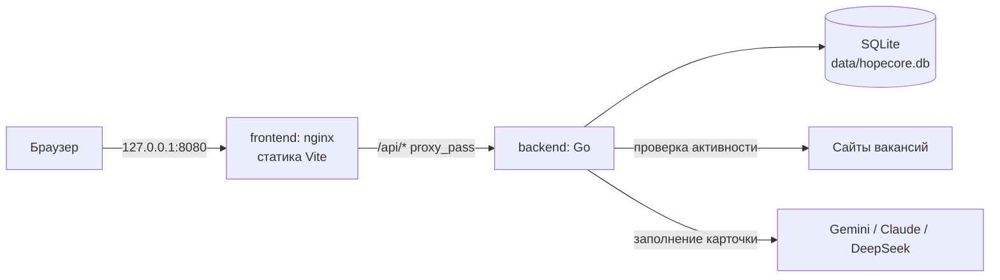
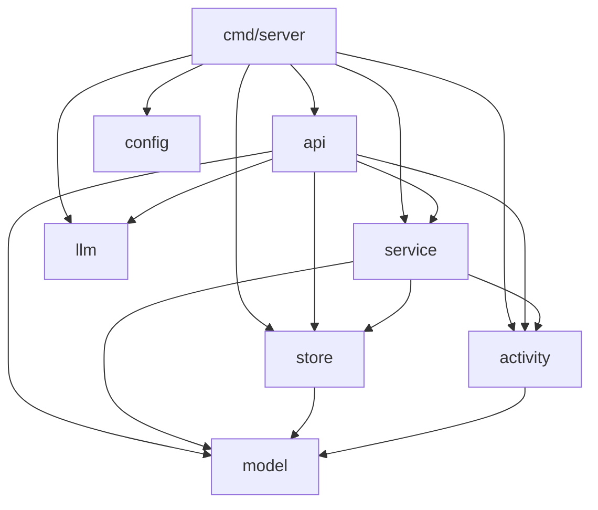
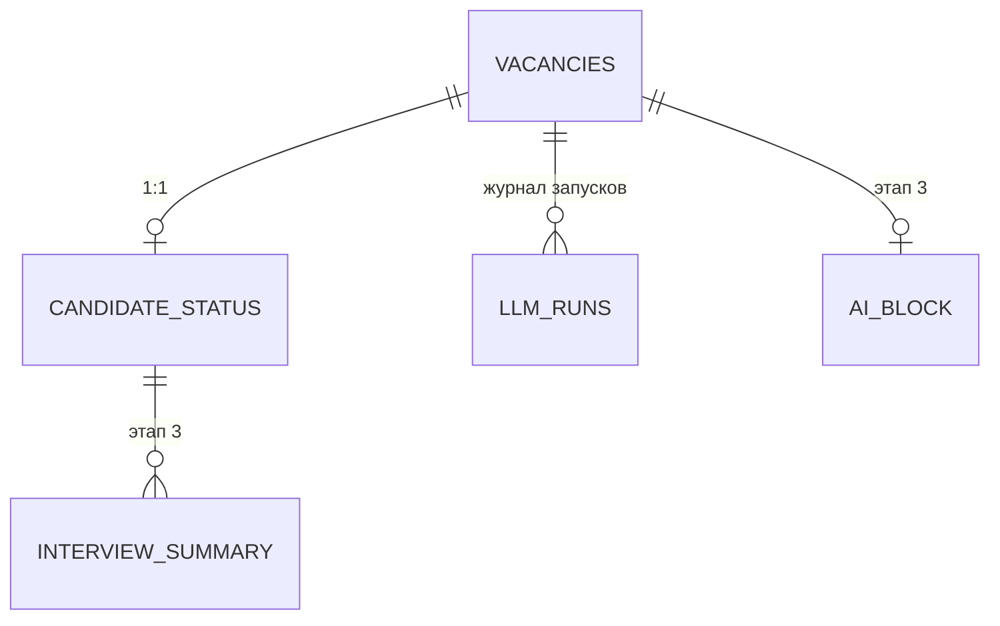

# Структура проекта

## Верхний уровень

```
hopecore/
  backend/            Go: REST API и работа с SQLite
  frontend/           React + Vite: тёмная админка
  data/               файл SQLite (не в git, создаётся при первом запуске)
  docs/main/          ТЗ и дизайн-документы по этапам
  docs/poject/        описание того, как устроено сейчас
  docker-compose.yml  два сервиса, порт только на 127.0.0.1
  .env.example        шаблон настроек; .env необязателен
  README.md           запуск, настройка, разработка
```

## Как это работает вместе



nginx отдаёт статику и проксирует `/api` на `backend:8080`. Наружу торчит один порт, backend свой не публикует вовсе. Фронт обращается по относительному пути, поэтому CORS не нужен и адрес backend ему неизвестен.

---

## Backend

```
backend/
  cmd/server/main.go        конфигурация, БД, миграция, сервер, graceful shutdown
  internal/
    config/                 настройки сервера из env
    model/                  сущности и их отображение в SQLite
    store/                  подключение, миграция, запросы, резервные копии
    activity/               правило активности и HTTP-проверка
    fetcher/                скачивание страницы вакансии и очистка HTML
    llm/                    схема извлечения, промпт, разбор ответа, конфигурация
    llm/gemini/             адаптер Gemini
    llm/registry/           сборка адаптеров по конфигурации
    service/                оркестрация: сценарии поверх store и внешнего мира
    api/                    роутер, хендлеры, DTO, формат ошибок
  Dockerfile                multi-stage, CGO_ENABLED=0, non-root
```

### Зависимости пакетов



Зависимости направлены в одну сторону, и это не случайно: **`activity` не знает про БД**, **`store` не знает про сеть**. Связывает их `service`. Если бы оркестрация массовой проверки лежала в `activity`, получился бы цикл импортов со `store` — на этом и построено решение вынести её отдельно.

### Пакеты подробнее

Строки указаны вместе с тестами: у большинства пакетов тестов больше, чем кода.

| Пакет | Строк | Содержимое |
|---|---|---|
| `model` | ~720 | `Vacancy`, `CandidateStatus`, `InterviewSummary`, `AIBlock`, `LLMRun`; типы `Tags` (JSON ↔ `[]string`) и `Date` (дата без времени); наборы грейдов и форматов работы |
| `store` | ~2200 | `Open`/`OpenMemory`/`Migrate`, запросы по вакансиям, статусу и журналу запусков, `ActiveFilterSQL`, чтение pragma, резервные копии |
| `activity` | ~590 | `Resolve(auto, manual)`, интерфейс `Checker` и его HTTP-реализация, `Classify`, `ApplyResult` |
| `fetcher` | ~1100 | скачивание с cookie jar и лимитами, очистка HTML парсером `x/net/html`, типизированные виды неудач |
| `service` | ~500 | `ActivityService`: проверка активности и ручной override. `ExtractionService`: склейка «скачать → спросить модель → провалидировать → записать в журнал» |
| `llm` | ~2000 | `ProviderConfig` со скрытым при выводе ключом, `Pricing`, `LoadConfig`; схема извлечения, промпт с версией, разбор и валидация ответа модели |
| `llm/gemini` | ~840 | адаптер: перевод схемы в формат Gemini, отключение размышлений, счётчики токенов |
| `llm/registry` | ~110 | сборка адаптеров по конфигурации |
| `api` | ~5100 | роутер на stdlib `ServeMux`, хендлеры, DTO с валидацией, `Optional[T]`, единый формат ошибок |
| `config` | ~90 | `PORT`, `DB_PATH`, `CHECK_TIMEOUT`, `CHECK_CONCURRENCY`, `LOG_LEVEL` |

Несколько решений, которые видно только в коде:

- Роутер — `http.ServeMux` из стандартной библиотеки. С Go 1.22 он умеет паттерны с методом и wildcard-сегментами, поэтому внешний роутер не понадобился.
- `Optional[T]` в `api` различает три состояния поля JSON: отсутствует, `null`, значение. Без него `PATCH` не смог бы отличить «не трогай» от «сотри».
- Служебные 404 и 405 от `ServeMux` переводятся в общий JSON-формат middleware-ом `withJSONErrors`, а не catch-all маршрутом: маршрут перехватил бы путь целиком и сломал бы 405.
- `Deps` вместо списка аргументов в `NewServer`: зависимостей становится больше с каждым этапом.

---

## Схема БД



Таблицы `interview_summary` и `ai_block` созданы миграцией заранее, но используются только с Этапа 3 — так позже не придётся возиться с миграциями.

Связи с вакансией устроены по-разному, и это осознанно: статус кандидата, резюме собеседований и нейроблок удаляются каскадом вместе с вакансией, а у `llm_runs` внешний ключ обнуляется (`ON DELETE SET NULL`). История трат по квоте не должна исчезать вместе с карточкой.

### `vacancies`

| Поле | Тип | Примечание |
|---|---|---|
| `id` | integer PK | |
| `url` | text, not null | индекс |
| `title` | text | должность |
| `company`, `grade` | text | грейд из фиксированного набора |
| `tech_tags` | text | JSON-массив: в SQLite нет массивов |
| `opened_date` | text | `YYYY-MM-DD` |
| `salary_from`, `salary_to` | real, nullable | вилка из объявления, может быть односторонней |
| `salary_currency` | text | код валюты, три буквы |
| `salary_gross` | numeric, nullable | `true` — до вычета налогов, `false` — на руки, `null` — не указано |
| `work_format` | text | `onsite`, `hybrid`, `remote` |
| `auto_is_active` | numeric, nullable | результат проверки; `null` — неизвестно |
| `manual_is_active` | numeric, nullable | решение пользователя; `null` — override не задан |
| `last_checked_at`, `last_check_code`, `last_check_error` | | когда вручную проверяли и что ответил сайт |
| `created_at`, `updated_at` | datetime | |

### `candidate_status`

Уникальный индекс по `vacancy_id` держит связь 1:1. Поля по п. 4.2 ТЗ: сопроводительное письмо, дата отклика, этап собеседования, контакт HR, ссылка на запись, признак оффера, предлагаемая и реальная зарплата, данные о рынке.

Внешние ключи с `ON DELETE CASCADE` работают благодаря включённому `foreign_keys`.

### Настройки соединения

`foreign_keys=on`, `journal_mode=DELETE`, `busy_timeout=5000`, пул из одного соединения.

Про журнал: WAL сознательно **не** используется. Он нужен для параллельных читателей при активном писателе, а здесь одно соединение и один пользователь. Зато WAL держит состояние в разделяемой памяти через файл `-shm`, а база лежит в bind-mount и доступна ещё и с хоста — на этой связке файл однажды был повреждён. Подробности в [дизайне Этапа 1](../main/design-stage1.md), п. 5.4.

При отладке: `PRAGMA foreign_keys` из хостовой утилиты `sqlite3` покажет `0`, потому что это настройка соединения, а не файла. У приложения она включена.

### Резервные копии

Копии лежат в `backups/` рядом с файлом базы: внутри bind-mount, поэтому видны с хоста как `data/backups/`. Код — `internal/store/backup.go`, эндпоинты — `internal/api/backups.go`.

**Снятие копии — `VACUUM INTO`.** Единственный способ получить целостный снимок работающей базы средствами SQL. Копирование файла отвергнуто: оно может застать базу в середине записи. Низкоуровневый Backup API SQLite через `database/sql` недоступен.

**Восстановление — `ATTACH` плюс одна транзакция.** Копия подключается как вторая база, затем в одной транзакции таблицы очищаются и переливаются из неё. Внешние ключи на время переноса переводятся в `defer_foreign_keys`, иначе порядок таблиц пришлось бы выстраивать вручную. Транзакция даёт всё-или-ничего: сорвавшийся перенос оставляет базу как была.

Подмена файла базы рассматривалась и отвергнута: приложение держит файл открытым, и подмена на ходу означала бы гонку с открытым соединением. Вариант «положить файл и перезапустить контейнер» отвергнут из-за UX.

**Перед восстановлением автоматически снимается копия текущего состояния** (суффикс `before-restore`). Это и есть ответ на вопрос «а если восстановился не туда»: шаг обратим.

**Имя файла проверяется регулярным выражением** `^hopecore-\d{8}-\d{6}(-[a-z0-9-]+)?\.db$`, и отдельно проверяется, что собранный путь не вышел из каталога копий. Имя приходит из URL, поэтому это не косметика: без проверки `../../` дало бы чтение и удаление произвольных файлов. Транспорт отсекает часть таких попыток и сам (nginx отвечает `405` на закодированные слеши), но защита не должна на это опираться.

Копия со схемой другой версии тоже годится: переносятся таблицы, которые есть в снимке, а отсутствующие в нём — очищаются.

---

## Frontend

```
frontend/
  src/
    api/
      client.ts             fetch-обёртка, класс ApiError с code и fields
      types.ts              типы ответов, наборы грейдов и форматов
      vacancies.ts          ключи запросов, чтение и мутации вакансий
      candidateStatus.ts    upsert статуса
      activity.ts           проверка активности, override, сводка
      llm.ts                провайдеры, журнал запусков, карточка запуска
      backups.ts            список копий, создание, восстановление, удаление
    lib/
      utils.ts              cn(): склейка классов с разрешением конфликтов Tailwind
      format.ts             даты, вилка, формат работы, описание активности, размеры файлов
      queryClient.ts        настройки TanStack Query
    components/
      ui/                   button, badge, spinner, switch, checkbox, dialog,
                            field, tags-input, toast — в стиле shadcn/ui
      layout/               AppLayout, Sidebar
      vacancies/            VacancyTable, ActivityBadge, ActivityPanel,
                            VacancyFormDialog, CandidateStatusForm, StagePlaceholder,
                            ExtractButton, ExtractPreviewDialog
      llm/                  RunStatusBadge, RunDetailDialog
    pages/                  VacanciesPage, VacancyPage, LlmRunsPage, BackupsPage,
                            NotFoundPage
    App.tsx, main.tsx       маршруты и провайдеры
    index.css               Tailwind 4: палитра в @theme
  scripts/smoke.mjs         рендер экранов в строку: ловит битые импорты
  nginx.conf                статика + proxy_pass /api
  Dockerfile                node build -> nginx
```

### Решения, заметные в коде

- **Tailwind 4** без `tailwind.config.js`: палитра живёт в блоке `@theme` внутри CSS, компоненты ссылаются на смысл (`surface`, `border`, `muted`), а не на оттенок.
- **Компоненты shadcn/ui написаны руками** через `cva` + `cn`, без запуска CLI: нужен небольшой набор, генератор притащил бы лишнее.
- **Модальные окна на нативном `<dialog>`**, а не на Radix: платформа сама даёт `aria-modal`, захват фокуса, Escape и `::backdrop`.
- **Таблица на TanStack Table v9**: возможности подключаются явно через `tableFeatures`, поэтому в бандл попадает только сортировка.
- **Флаг «показать неактивные» живёт в URL** (`?inactive=1`): вид восстанавливается по ссылке и кнопкой «назад» из карточки.
- **Формы хранят зарплаты строками**, а не числами: иначе не отличить «не заполнено» от «ноль».
- **Клавиатурный путь к карточке — ссылка в первой колонке**, а не `tabIndex` на строке: работает Cmd-клик, виден адрес перехода, строка не дублируется в tab-порядке.
- **Форма статуса не затирает несохранённый ввод** при внешнем обновлении данных: синхронизируется с сервером только если пользователь ничего не менял с последнего сохранения.

### Маршруты

| Путь | Экран |
|---|---|
| `/` | редирект на `/vacancies` |
| `/vacancies` | таблица вакансий |
| `/vacancies/:id` | карточка: данные, активность, статус кандидата, заглушки Этапа 3 |
| `/llm/runs` | журнал запусков модели: итоги расхода, таблица, карточка с сырым ответом |
| `/backups` | резервные копии: создание, восстановление с подтверждением, удаление |
| `*` | страница не найдена |

В сайдбаре «Поиск вакансий» — неактивная заглушка Этапа 2.1 (нужен токен `hh.ru`), «Нейроблок» — Этапа 3.

Заполнение через модель запускается кнопкой «Заполнить через LLM» в карточке вакансии. Диалога выбора провайдера нет: пока настроен один провайдер, берётся он и его модель по умолчанию — выбор появится, когда провайдеров станет больше одного. Дальше открывается предпросмотр: таблица «сейчас против предложенного» с галочками, отмечены только отличающиеся и прошедшие проверку поля. Применение идёт частичным `PATCH` по выбранным полям.

Одна деталь реализации, которую поймал смоук: отметки в предпросмотре **выводятся из результата при рендере**, а не переносятся в состояние через `useEffect`. Хранится только то, что пользователь переключил руками. С эффектом первый кадр показывал «Применить отмеченные (0)» и лишь потом обновлялся.

---

## Конфигурация

Все настройки — переменные окружения. `.env` необязателен: без него работают значения по умолчанию, и `docker compose up --build` после клонирования не требует настройки.

### Запуск

| Переменная | Назначение | По умолчанию |
|---|---|---|
| `HOST_PORT` | порт на хосте (только `127.0.0.1`) | `8080` |
| `DATA_DIR` | каталог с файлом SQLite | `./data` |

### Backend

| Переменная | Назначение | По умолчанию |
|---|---|---|
| `PORT` | порт HTTP-сервера внутри контейнера | `8080` |
| `DB_PATH` | путь к файлу БД | `/data/hopecore.db` |
| `CHECK_TIMEOUT` | таймаут запроса к сайту вакансии | `10s` |
| `CHECK_CONCURRENCY` | параллельность массовой проверки | `4` |
| `LOG_LEVEL` | `debug`, `info`, `warn`, `error` | `info` |

### Языковые модели

| Переменная | Назначение | По умолчанию |
|---|---|---|
| `GEMINI_API_KEY`, `ANTHROPIC_API_KEY`, `DEEPSEEK_API_KEY` | ключи; провайдер без ключа скрыт | — |
| `LLM_GEMINI_MODELS`, `LLM_CLAUDE_MODELS`, `LLM_DEEPSEEK_MODELS` | списки моделей через запятую; первая предвыбирается | по одной на провайдера |
| `LLM_<PROVIDER>_PRICE_INPUT` / `_OUTPUT` | цена за 1M токенов для оценки стоимости | — |
| `LLM_TIMEOUT` | таймаут запроса к модели | `60s` |
| `LLM_FETCH_TIMEOUT` | таймаут скачивания страницы | `15s` |
| `LLM_MAX_PAGE_CHARS` | сколько символов страницы отдавать модели | `40000` |

Ключи не попадают ни в логи, ни в ответы API. Битая настройка валит старт с понятным сообщением, а не всплывает при первом запросе.

### Таймауты по цепочке

| Уровень | Значение |
|---|---|
| Один запрос к сайту при проверке активности | `CHECK_TIMEOUT`, 10 с |
| Массовая проверка целиком | 4 минуты |
| Запрос к языковой модели | `LLM_TIMEOUT`, 60 с |
| `WriteTimeout` HTTP-сервера | 5 минут |
| `proxy_read_timeout` в nginx | 300 с |

Верхние уровни заведомо больше нижних, иначе долгий, но законный прогон обрывался бы на прокси.

---

## Проверки

```bash
cd backend && go test ./...     # 234 теста в 9 пакетах
cd frontend && npm run build    # проверка типов + сборка
cd frontend && npm run smoke    # 184 проверки рендера
docker compose up --build       # сквозная проверка
```

Тесты backend не выходят в сеть: HTTP-чекер проверяется против `httptest.Server`, БД поднимается в памяти, провайдеры моделей подменяются стабами.

Смоук фронта грузит все модули через SSR-конвейер Vite и рендерит экраны в строку. Он не заменяет тесты, но ловит битые импорты и падения на первом рендере — например, так обнаружилась смена API в TanStack Table v9.

### `llm_runs`

Журнал обращений к языковой модели: `purpose`, `vacancy_id` (nullable), `provider`, `model`, `prompt_version`, `source_url`, `source_chars`, `status`, счётчики токенов, `cost_estimate`, `attempts`, `duration_ms`, `error`, `response_json`.

Запись создаётся на всех путях, включая неудачные: ошибка скачивания тоже попадает в журнал, но с пустыми счётчиками токенов — видно, что попытка была и почему она ничего не стоила. Счётчики nullable, потому что провайдер может их не вернуть, и ноль в этом случае был бы неправдой.

Статусы: `ok`, `fetch_error`, `provider_error`, `invalid_json`, `timeout`.

---

## Про версию Go

`go.mod` требует Go 1.22, образ в Dockerfile — `golang:1.23-alpine`. Это не рассогласование, а запас: модуль должен собираться тулчейном образа.

Тонкость, которая один раз стоила сломанной сборки: `go get` может подтянуть зависимость, требующую более новый Go, и `go mod tidy` молча поднимет директиву `go` в `go.mod`. Локально это незаметно — Go сам скачает нужный тулчейн, — а в alpine-образе скачивание запрещено, и сборка падает на `go mod download`. От этого страхуют два теста в `cmd/server`: они сверяют директиву `go` с версией образа и следят, чтобы не появилась строка `toolchain`.

Поэтому `golang.org/x/net` закреплён на `v0.35.0` — последней ветке, совместимой с Go 1.22, вместе с соответствующими `x/text` и `x/sys`.

---

## Про ключи провайдеров

Ключ хранится в `.env` (файл в `.gitignore`) и попадает в контейнер переменной окружения. Наружу он не выходит нигде: `GET /api/llm/providers` отдаёт только идентификаторы и модели, в логах при старте печатаются идентификатор и список моделей.

Дополнительная защита появилась после реального случая: упавший тест вывел структуру настроек через `%+v` вместе с настоящим ключом. Теперь `llm.ProviderConfig` реализует `String()` и `GoString()`, которые печатают `<скрыт, N символов>` вместо значения. Пока ключ был обычным полем, он утекал в первое же сообщение об ошибке; со Stringer это перестало быть возможным, и закреплено тестом на все формы вывода — `%v`, `%+v`, `%#v`, `%s`, срез и вложение в другую структуру.

## Живые проверки

Тесты не выходят в сеть: HTTP-чекер и адаптер провайдера проверяются против `httptest.Server`, БД поднимается в памяти. Отдельно есть диагностические тесты против настоящих сайтов и настоящего Gemini — они пропускаются, пока не задана переменная окружения:

```bash
HOPECORE_LIVE=1 go test ./internal/fetcher -run Live -v
HOPECORE_LIVE=1 GEMINI_API_KEY=... go test ./internal/llm/gemini -run Live -v
```

Осторожно с `export`: переменная остаётся в оболочке и включает сетевые тесты в последующих прогонах `go test ./...`. Лучше задавать её только для конкретной команды.
