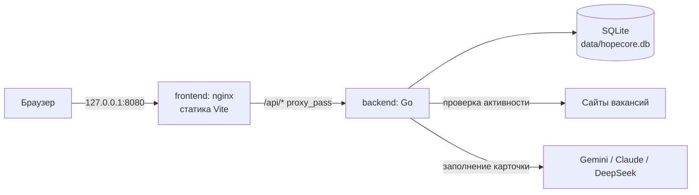
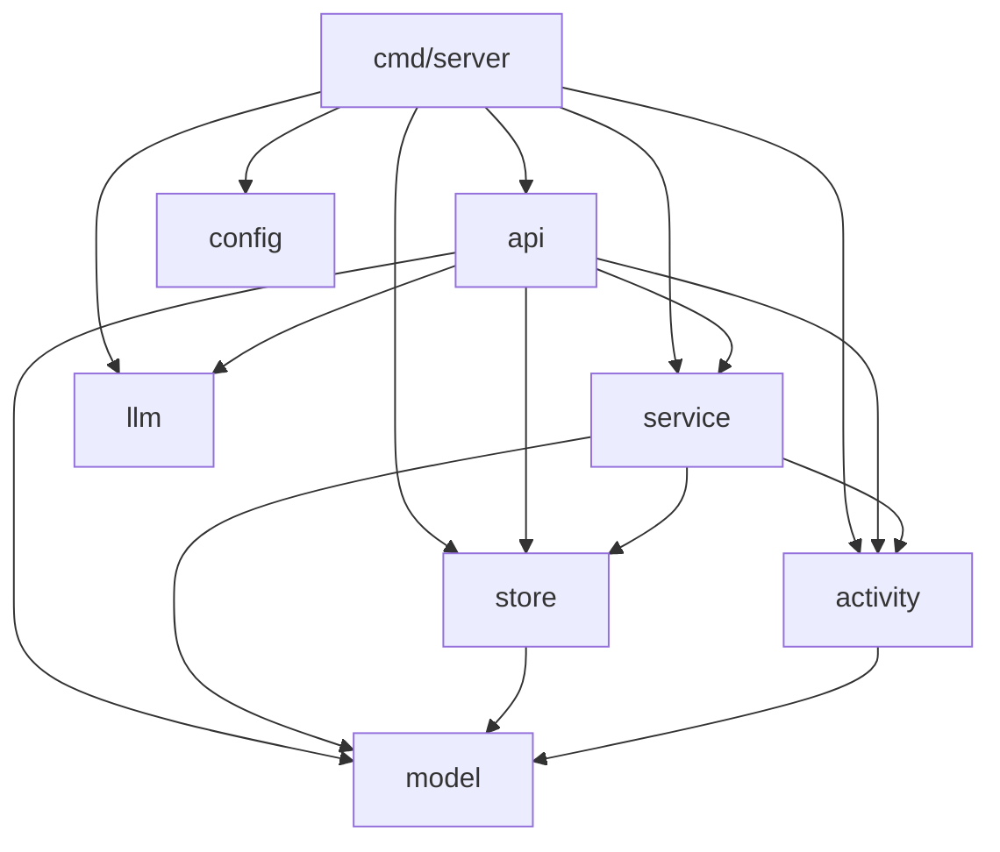
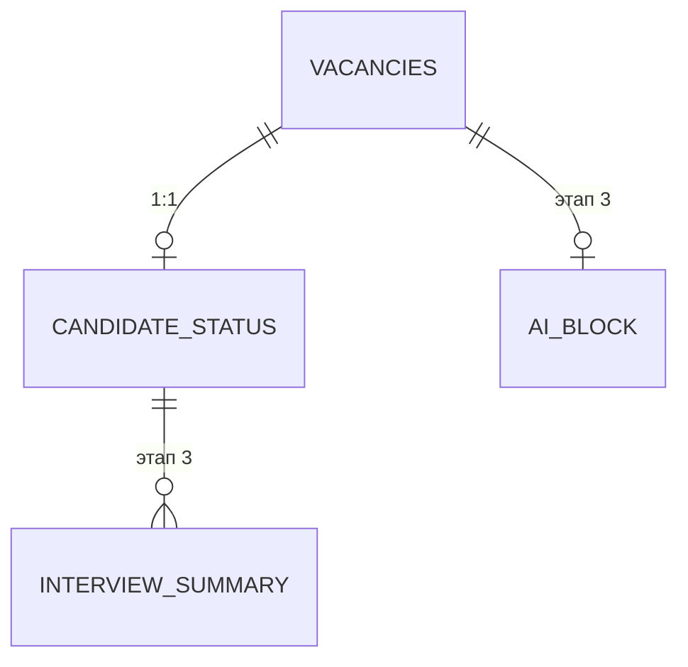

# Структура проекта

## Верхний уровень

```
hopecore/
  backend/            Go: REST API и работа с SQLite
  frontend/           React + Vite: тёмная админка
  data/               файл SQLite (не в git, создаётся при первом запуске)
  docs/main/          ТЗ и дизайн-документы по этапам
  docs/poject/        описание того, как устроено сейчас
  docker-compose.yml  два сервиса, порт только на 127.0.0.1
  .env.example        шаблон настроек; .env необязателен
  README.md           запуск, настройка, разработка
```

## Как это работает вместе



nginx отдаёт статику и проксирует `/api` на `backend:8080`. Наружу торчит один порт, backend свой не публикует вовсе. Фронт обращается по относительному пути, поэтому CORS не нужен и адрес backend ему неизвестен.

---

## Backend

```
backend/
  cmd/server/main.go        конфигурация, БД, миграция, сервер, graceful shutdown
  internal/
    config/                 настройки сервера из env
    model/                  сущности и их отображение в SQLite
    store/                  подключение, миграция, запросы
    activity/               правило активности и HTTP-проверка
    llm/                    провайдеры моделей: конфигурация, цены
    service/                оркестрация: сценарии поверх store и внешнего мира
    api/                    роутер, хендлеры, DTO, формат ошибок
  Dockerfile                multi-stage, CGO_ENABLED=0, non-root
```

### Зависимости пакетов



Зависимости направлены в одну сторону, и это не случайно: **`activity` не знает про БД**, **`store` не знает про сеть**. Связывает их `service`. Если бы оркестрация массовой проверки лежала в `activity`, получился бы цикл импортов со `store` — на этом и построено решение вынести её отдельно.

### Пакеты подробнее

| Пакет | Строк | Содержимое |
|---|---|---|
| `model` | ~640 | `Vacancy`, `CandidateStatus`, `InterviewSummary`, `AIBlock`; типы `Tags` (JSON ↔ `[]string`) и `Date` (дата без времени); наборы грейдов и форматов работы |
| `store` | ~900 | `Open`/`OpenMemory`/`Migrate`, запросы по вакансиям и статусу, `ActiveFilterSQL`, чтение pragma |
| `activity` | ~590 | `Resolve(auto, manual)`, интерфейс `Checker` и его HTTP-реализация, `Classify`, `ApplyResult` |
| `service` | ~220 | `ActivityService`: проверка одной вакансии, массовая проверка с worker pool, ручной override |
| `llm` | ~440 | `ProviderConfig`, `Pricing`, `LoadConfig` из env |
| `api` | ~3200 | роутер на stdlib `ServeMux`, хендлеры, DTO с валидацией, `Optional[T]`, единый формат ошибок |
| `config` | ~90 | `PORT`, `DB_PATH`, `CHECK_TIMEOUT`, `CHECK_CONCURRENCY`, `LOG_LEVEL` |

Несколько решений, которые видно только в коде:

- Роутер — `http.ServeMux` из стандартной библиотеки. С Go 1.22 он умеет паттерны с методом и wildcard-сегментами, поэтому внешний роутер не понадобился.
- `Optional[T]` в `api` различает три состояния поля JSON: отсутствует, `null`, значение. Без него `PATCH` не смог бы отличить «не трогай» от «сотри».
- Служебные 404 и 405 от `ServeMux` переводятся в общий JSON-формат middleware-ом `withJSONErrors`, а не catch-all маршрутом: маршрут перехватил бы путь целиком и сломал бы 405.
- `Deps` вместо списка аргументов в `NewServer`: зависимостей становится больше с каждым этапом.

---

## Схема БД



Все четыре таблицы создаются миграцией сразу, хотя `interview_summary` и `ai_block` используются только с Этапа 3 — так позже не придётся возиться с миграциями.

### `vacancies`

| Поле | Тип | Примечание |
|---|---|---|
| `id` | integer PK | |
| `url` | text, not null | индекс |
| `title` | text | должность |
| `company`, `grade` | text | грейд из фиксированного набора |
| `tech_tags` | text | JSON-массив: в SQLite нет массивов |
| `opened_date` | text | `YYYY-MM-DD` |
| `salary_from`, `salary_to` | real, nullable | вилка из объявления, может быть односторонней |
| `salary_currency` | text | код валюты, три буквы |
| `salary_gross` | numeric, nullable | `true` — до вычета налогов, `false` — на руки, `null` — не указано |
| `work_format` | text | `onsite`, `hybrid`, `remote` |
| `auto_is_active` | numeric, nullable | результат проверки; `null` — неизвестно |
| `manual_is_active` | numeric, nullable | решение пользователя; `null` — override не задан |
| `last_checked_at`, `last_check_code`, `last_check_error` | | когда вручную проверяли и что ответил сайт |
| `created_at`, `updated_at` | datetime | |

### `candidate_status`

Уникальный индекс по `vacancy_id` держит связь 1:1. Поля по п. 4.2 ТЗ: сопроводительное письмо, дата отклика, этап собеседования, контакт HR, ссылка на запись, признак оффера, предлагаемая и реальная зарплата, данные о рынке.

Внешние ключи с `ON DELETE CASCADE` работают благодаря включённому `foreign_keys`.

### Настройки соединения

`foreign_keys=on`, `journal_mode=DELETE`, `busy_timeout=5000`, пул из одного соединения.

Про журнал: WAL сознательно **не** используется. Он нужен для параллельных читателей при активном писателе, а здесь одно соединение и один пользователь. Зато WAL держит состояние в разделяемой памяти через файл `-shm`, а база лежит в bind-mount и доступна ещё и с хоста — на этой связке файл однажды был повреждён. Подробности в [дизайне Этапа 1](../main/design-stage1.md), п. 5.4.

При отладке: `PRAGMA foreign_keys` из хостовой утилиты `sqlite3` покажет `0`, потому что это настройка соединения, а не файла. У приложения она включена.

---

## Frontend

```
frontend/
  src/
    api/
      client.ts             fetch-обёртка, класс ApiError с code и fields
      types.ts              типы ответов, наборы грейдов и форматов
      vacancies.ts          ключи запросов, чтение и мутации вакансий
      candidateStatus.ts    upsert статуса
      activity.ts           проверка активности, override, сводка
    lib/
      utils.ts              cn(): склейка классов с разрешением конфликтов Tailwind
      format.ts             даты, вилка, формат работы, описание активности
      queryClient.ts        настройки TanStack Query
    components/
      ui/                   button, badge, spinner, switch, checkbox, dialog,
                            field, tags-input, toast — в стиле shadcn/ui
      layout/               AppLayout, Sidebar
      vacancies/            VacancyTable, ActivityBadge, ActivityPanel,
                            VacancyFormDialog, CandidateStatusForm, StagePlaceholder
    pages/                  VacanciesPage, VacancyPage, NotFoundPage
    App.tsx, main.tsx       маршруты и провайдеры
    index.css               Tailwind 4: палитра в @theme
  scripts/smoke.mjs         рендер экранов в строку: ловит битые импорты
  nginx.conf                статика + proxy_pass /api
  Dockerfile                node build -> nginx
```

### Решения, заметные в коде

- **Tailwind 4** без `tailwind.config.js`: палитра живёт в блоке `@theme` внутри CSS, компоненты ссылаются на смысл (`surface`, `border`, `muted`), а не на оттенок.
- **Компоненты shadcn/ui написаны руками** через `cva` + `cn`, без запуска CLI: нужен небольшой набор, генератор притащил бы лишнее.
- **Модальные окна на нативном `<dialog>`**, а не на Radix: платформа сама даёт `aria-modal`, захват фокуса, Escape и `::backdrop`.
- **Таблица на TanStack Table v9**: возможности подключаются явно через `tableFeatures`, поэтому в бандл попадает только сортировка.
- **Флаг «показать неактивные» живёт в URL** (`?inactive=1`): вид восстанавливается по ссылке и кнопкой «назад» из карточки.
- **Формы хранят зарплаты строками**, а не числами: иначе не отличить «не заполнено» от «ноль».
- **Клавиатурный путь к карточке — ссылка в первой колонке**, а не `tabIndex` на строке: работает Cmd-клик, виден адрес перехода, строка не дублируется в tab-порядке.
- **Форма статуса не затирает несохранённый ввод** при внешнем обновлении данных: синхронизируется с сервером только если пользователь ничего не менял с последнего сохранения.

### Маршруты

| Путь | Экран |
|---|---|
| `/` | редирект на `/vacancies` |
| `/vacancies` | таблица вакансий |
| `/vacancies/:id` | карточка: данные, активность, статус кандидата, заглушки Этапа 3 |
| `*` | страница не найдена |

Раздел «Поиск LLM» в сайдбаре — неактивная заглушка Этапа 2, «Нейроблок» — Этапа 3.

---

## Конфигурация

Все настройки — переменные окружения. `.env` необязателен: без него работают значения по умолчанию, и `docker compose up --build` после клонирования не требует настройки.

### Запуск

| Переменная | Назначение | По умолчанию |
|---|---|---|
| `HOST_PORT` | порт на хосте (только `127.0.0.1`) | `8080` |
| `DATA_DIR` | каталог с файлом SQLite | `./data` |

### Backend

| Переменная | Назначение | По умолчанию |
|---|---|---|
| `PORT` | порт HTTP-сервера внутри контейнера | `8080` |
| `DB_PATH` | путь к файлу БД | `/data/hopecore.db` |
| `CHECK_TIMEOUT` | таймаут запроса к сайту вакансии | `10s` |
| `CHECK_CONCURRENCY` | параллельность массовой проверки | `4` |
| `LOG_LEVEL` | `debug`, `info`, `warn`, `error` | `info` |

### Языковые модели

| Переменная | Назначение | По умолчанию |
|---|---|---|
| `GEMINI_API_KEY`, `ANTHROPIC_API_KEY`, `DEEPSEEK_API_KEY` | ключи; провайдер без ключа скрыт | — |
| `LLM_GEMINI_MODELS`, `LLM_CLAUDE_MODELS`, `LLM_DEEPSEEK_MODELS` | списки моделей через запятую; первая предвыбирается | по одной на провайдера |
| `LLM_<PROVIDER>_PRICE_INPUT` / `_OUTPUT` | цена за 1M токенов для оценки стоимости | — |
| `LLM_TIMEOUT` | таймаут запроса к модели | `60s` |
| `LLM_FETCH_TIMEOUT` | таймаут скачивания страницы | `15s` |
| `LLM_MAX_PAGE_CHARS` | сколько символов страницы отдавать модели | `40000` |

Ключи не попадают ни в логи, ни в ответы API. Битая настройка валит старт с понятным сообщением, а не всплывает при первом запросе.

### Таймауты по цепочке

| Уровень | Значение |
|---|---|
| Один запрос к сайту при проверке активности | `CHECK_TIMEOUT`, 10 с |
| Массовая проверка целиком | 4 минуты |
| Запрос к языковой модели | `LLM_TIMEOUT`, 60 с |
| `WriteTimeout` HTTP-сервера | 5 минут |
| `proxy_read_timeout` в nginx | 300 с |

Верхние уровни заведомо больше нижних, иначе долгий, но законный прогон обрывался бы на прокси.

---

## Проверки

```bash
cd backend && go test ./...     # 111 тестов
cd frontend && npm run build    # проверка типов + сборка
cd frontend && npm run smoke    # 122 проверки рендера
docker compose up --build       # сквозная проверка
```

Тесты backend не выходят в сеть: HTTP-чекер проверяется против `httptest.Server`, БД поднимается в памяти, провайдеры моделей подменяются стабами.

Смоук фронта грузит все модули через SSR-конвейер Vite и рендерит экраны в строку. Он не заменяет тесты, но ловит битые импорты и падения на первом рендере — например, так обнаружилась смена API в TanStack Table v9.
